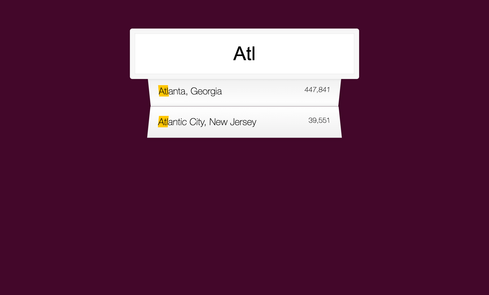

# Ajax Typeahead Feature: Vanilla JS

## Table of Contents

- [Description](#description)
- [Usage](#usage)
- [Credits](#credits)
- [License](#license)

## Description

Using the built-in browser API fetch, our interactive search box finds all matching cities or states with each letter typed. As an added measure, it populates each city's population alongside the search results and highlights the matching text. Created with only Vanilla JavaScript.

## Usage

## Credits

Wes Bos's Vanilla JavaScript 30 Day Challenge
https://javascript30.com/

## License

No licenses (default copyright laws apply).

---
